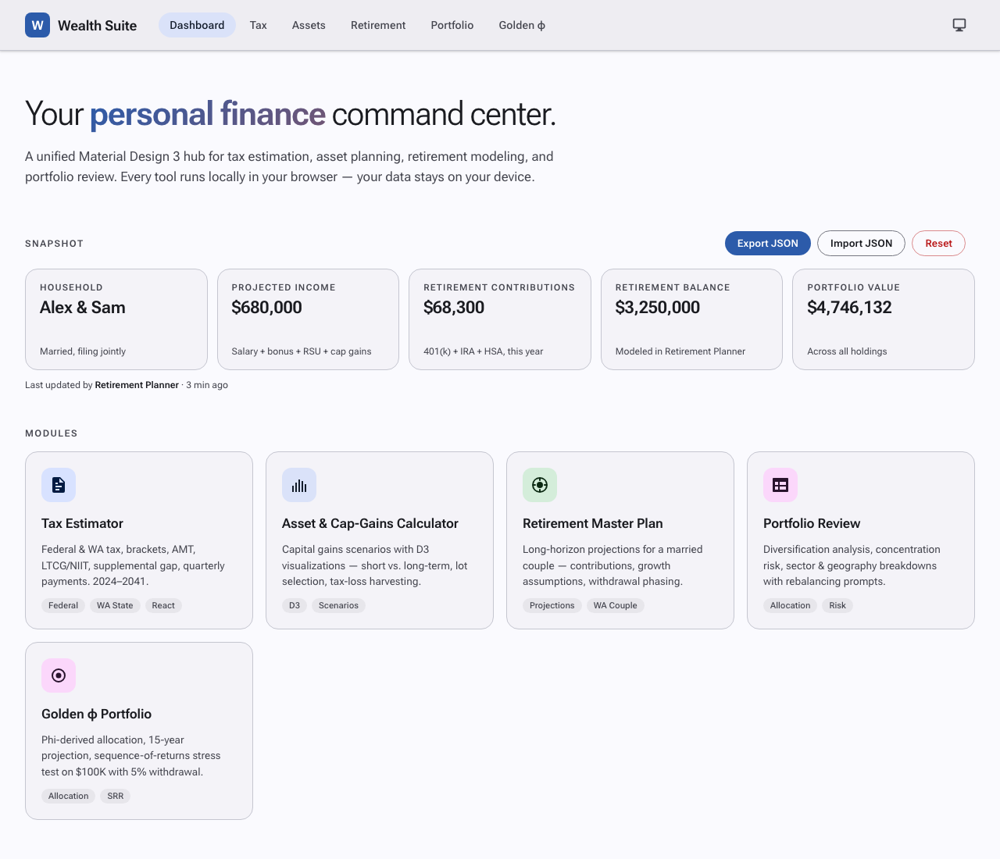

# Getting Started with Wealth Suite

A one-stop personal finance hub that runs **entirely in your browser**. No accounts, no tracking, no upload — your data lives in your browser's local storage and only goes anywhere if you choose to export it.

The suite bundles five specialised tools behind a unified dashboard. Once you enter your numbers in one tool, related tools see the same household automatically.

**Live site:** <https://kkgeek.github.io/tools/>

---

## What's in the suite

| Module | What it's for |
|---|---|
| **Tax Estimator** | Federal + WA state tax for 2024–2041, including AMT, LTCG, NIIT, RSU supplemental gap, quarterly payments. The household profile (income, contributions, deductions) lives here and feeds the others. |
| **Asset & Cap-Gains Calculator** | Capital-gains scenarios with D3 visualisations. What-if mode — pull household income & gains in with one click, then tweak. |
| **Retirement Master Plan** | Long-horizon projections for a married couple. RMD calculator with traditional-IRA balance slider and progressive bracket visualisation. |
| **Portfolio Review** | Diversification + concentration risk on a 140-position portfolio. Allocation report. |
| **Golden φ Portfolio** | Phi-derived allocation with 15-year projection and sequence-of-returns stress test. |

The dashboard sits above all five and shows a live snapshot of your household.

---

## First run — what you see

Open the site and you land on the dashboard.


The **Snapshot** card says "No household data yet" because you haven't filled anything in. The **Modules** grid below links to every tool. The header chips on the right (`Export JSON`, `Import JSON`, `Reset`) are how you move data in and out — see [Backups & sharing](#backups--sharing) below.

---

## A 5-minute walkthrough

The intended flow is **Tax Estimator → everywhere else**. Tax Estimator is the only tool with first-class data entry; once your household is in, the other tools surface it automatically.

### 1. Enter your household in the Tax Estimator

Click the **Tax** tab in the topbar. You'll see a year + filing-status panel, then per-spouse income and retirement contributions, then capital gains and deductions.


What to fill in:

- **Tax Year** — defaults to 2026, projected from 2025 IRS data (2.5% COLA). 2024 and 2025 are confirmed; 2027+ are projections you can edit in the *IRS Data Admin* tab if needed.
- **Filing Status** — Single or Married Filing Jointly. (MFS is not modelled.)
- **Spouse 1 / Spouse 2** — age, salary, bonus, RSU vests, 401(k) contributions (Traditional/Roth/After-tax/Catch-up), IRA, HSA. Use the **Max** chips beside the limits to fill the legal cap for the year.
- **Capital Gains** — short-term and long-term, household total.
- **Deductions** — standard or itemised; itemised lets you enter mortgage interest, SALT, charitable, etc.

Every keystroke is auto-saved (`taxSuiteInputs_v2` in localStorage). The Calculate Tax button at the bottom shows your total liability with bracket breakdown, AMT/NIIT detection, and quarterly-payment suggestions.

> **Behind the scenes:** as you type, the Tax Estimator's adapter mirrors your household into the suite store with debounce. The dashboard's Snapshot widget reflects the new totals within a second.

### 2. Check the dashboard

Click **Dashboard** in the topbar. You'll see five tiles populated from what you just entered:



- **Household** — names, filing status, state.
- **Projected income** — sum of salary + bonus + RSU + capital gains (household).
- **Retirement contributions** — 401(k) + IRA + HSA across both spouses, this year.
- **Retirement balance** — set later in the Retirement Planner.
- **Portfolio value** — set later by visiting Portfolio Review.

The "Last updated by …" line tells you which tool most recently touched the data.

### 3. Open Retirement Master Plan

Click **Retirement** in the topbar.


A small all-caps line under the page title reads:

> **WEALTH SUITE HOUSEHOLD · INCOME $645,000 · CONTRIBUTIONS $68,300/YR · AGES 42 & 40**

That's the suite confirming this report is being read in the context of the household you entered in Tax. Browse through the tabs:

- **Overview** — readiness scorecard, 8-tile diagnostic.
- **3-yr buffer** — sequence-of-returns risk planning.
- **Projection** — bull / base / stress portfolio paths from age 55 to 90.
- **Roth + SS** — claim-age strategy + cumulative SS benefit by claim age.
- **Tax strategy / Estate plan / Timeline** — narrative reports.
- **RMD calculator** — drag the slider to model your traditional-IRA balance at age 73; the tool shows your RMD, taxable income, marginal rate, and how it cascades into IRMAA, WA millionaire tax, etc. **Slider position is saved** — come back tomorrow and your scenario is still there. The dashboard's "Retirement balance" tile mirrors whatever the slider shows.

### 4. Open Portfolio Review

Click **Portfolio** in the topbar.


This module is a structured analysis of a real-world 140-position, ~$4.75M portfolio: concentration risk, target allocation, ETF picks, a 4-year diversification plan. The household banner is here too.

Visiting this page is what populates the dashboard's **Portfolio value** tile (and `portfolio.allocations` in the suite store), which feeds the Asset Calculator next.

### 5. Open the Asset & Cap-Gains Calculator

Click **Assets** in the topbar.


You'll see two views: **Tax Calculator** (Capital Gains) and **Asset Allocation**. Above each form is a banner:

> **Wealth Suite:** income $645,000 · gains $5,000 ST · $30,000 LT · portfolio $4,746,132     [`Apply to Capital Gains`]

Click **Apply** and the form below pre-fills from your household — tax year, filing status, ordinary income, ST/LT gains. Then tweak any field for what-if scenarios (e.g. *what if I realised an extra $50k in long-term gains this year?*). The calculator runs the math against the year's bracket data and shows federal ordinary, federal LTCG, NIIT, and WA CGT separately.

Switch to the **Asset Allocation** tab and the same banner appears with an **Apply to Allocation** button — click and the "Total Amount to Allocate" pre-fills with your portfolio value, then tweak the % splits to model rebalancing.

---

## Backups & sharing

Three buttons next to the **Snapshot** title on the dashboard:

| Button | What it does |
|---|---|
| **Export JSON** | Downloads `wealth-suite-export-YYYY-MM-DD.json` — a single self-contained file with everything in your snapshot. Use this to back up before a Reset, move between machines, or share a scenario with your accountant. |
| **Import JSON** | Pick a file you previously exported (or any file in the same shape). You'll get a confirm dialog before it overwrites your current snapshot. |
| **Reset** | Wipes the snapshot **and** the Tax Estimator's saved inputs. Use Export first if you want to come back. Theme preference and the IRS rates cache are kept. |

**Cross-tab edit detection:** if you have, say, the Tax Estimator open in one tab and you import a snapshot in another tab, the Tax Estimator tab will surface a yellow banner under the topbar saying *data updated in JSON import — Reload to pull the latest*. Click Reload to re-seed the form from the new state.

---

## Theme

The icon on the far right of the topbar cycles **system → light → dark**. Your preference is remembered.

---

## Tips & gotchas

- **The Tax Estimator owns your household.** Other tools mirror or display its data; only Tax Estimator persists detailed inputs. If you want to start from a JSON snapshot you imported, open Tax Estimator once after import — it'll pre-fill from the snapshot.
- **Asset Calculator only knows 2024 and 2025 brackets.** If you set 2030 in Tax Estimator, the Asset Calculator will clamp to its latest available year (2025) when you click Apply. The Tax Estimator itself supports 2024–2041.
- **Portfolio Review numbers are baked into that page.** It's a static report for one specific portfolio. The total is parsed from the page header into the dashboard tile, but the breakdown is not editable in the browser yet — that lives in the page's HTML and would need a code edit to change.
- **Retirement Planner overview text is also baked in.** The household banner is the only piece that reflects your data; the rest is the personalised report by design.
- **MFJ-only**. Married Filing Separately is not supported. WA-only for state tax (federal logic is general).
- **Privacy.** Nothing leaves your browser unless you click Export. Even the IRS-rates auto-sync only fetches `irs-rates.json` from the public GitHub repo — no PII is ever sent.

---

## Trouble­shooting

- **Tile shows `—` even though I entered data.** That field is genuinely empty in the suite store. Income/contribution tiles need at least one of the per-spouse fields set; null counts as "no data," not as "$0".
- **The "Updated in [tool]" banner won't go away.** Click Reload — it re-seeds the active tool from the latest store contents.
- **Data feels stale after Reset.** Reset only clears the snapshot + `taxSuiteInputs_v2`. The IRS rates cache (`taxSuiteConfirmedYears`) and your saved theme are intentionally preserved. To do a *full* clean slate, clear the entire site's localStorage in your browser's devtools.
- **Imported file rejected.** It must be either a `wealth-suite-export-v1` envelope file or a raw state object with a `meta.version` field. Free-form JSON won't be accepted.
- **A page won't render.** The tools depend on a few CDN scripts (React, Tailwind, Chart.js, D3). If your network blocks any of those (corporate firewall, ad-blocker), the page won't draw. Open browser devtools → Network and look for failed fetches to `unpkg.com`, `cdnjs.cloudflare.com`, or `cdn.tailwindcss.com`.

---

## A note on running locally

If you're hosting the suite yourself and not from GitHub Pages:

```bash
# from the repo root
python3 -m http.server 3001 --bind 127.0.0.1
# then open http://127.0.0.1:3001/
```

Any static file server works. The tools are pure HTML + CSS + vanilla/React-via-CDN — no build step. After editing any file under `assets/`, bump the `?v=N` query string on its `<script>` / `<link>` tag in the HTML pages so browsers don't serve a stale cached copy.
