# Getting Started with Wealth Suite

A one-stop personal finance hub that runs **entirely in your browser**. No accounts, no tracking, no upload — your data lives in your browser's local storage and only goes anywhere if you choose to export it.

The suite bundles twelve specialised tools inside one **app shell** — a collapsible sidebar, a top bar, and a hash router that opens every tool in the same window (no page reloads). A **Data Hub** page is the single source of truth: enter your accounts, holdings, and assets once there and every tool reads from the same store.

**Live site:** <https://kkgeek.github.io/tools/>

---

## What's in the suite

### The shell

| Page | What it's for |
|---|---|
| **Dashboard** | Home screen: net worth, portfolio, retirement readiness, spending vs. budget, and performance-vs-benchmarks, all computed live from your data. |
| **Data Hub** | **All data entry.** Brokerage CSV import, live price refresh, accounts registry (with tax treatment), other assets, liabilities, expense CSV import, full JSON backup. |
| **Settings** | Household profile, named scenarios, tax profile, appearance (theme/accent/currency), alerts, data controls. |

### The tools

| Tool | What it's for |
|---|---|
| **Tax Estimator** | Federal + WA state tax for 2024–2041. AMT, LTCG, NIIT, RSU supplemental gap, quarterly payments. The most detailed data-entry tool for household/income info. |
| **Asset & Cap-Gains Calc** | Capital-gains scenarios with 2024–2026 bracket data and D3 visualisations. "Apply" button pulls your household numbers in with one click. |
| **Retirement Master Plan** | Long-horizon projections, RMD calculator, 3-year buffer sizing, Roth + Social Security strategy. |
| **Estate Plan** | Federal (OBBBA) and WA estate tax, trust strategy, beneficiary audit — split out from the Retirement tool into its own page. |
| **Portfolio Review** | Concentration risk and target allocation. |
| **Golden φ Portfolio** | Phi-derived allocation (1 : 0.618 : 0.382) with 15-year projection and sequence-of-returns stress test. |
| **Roth Conversion Planner** | Year-by-year conversion schedule filling your chosen bracket ceiling; Roth vs. traditional balance comparison. |
| **Portfolio Tracker** | Live Yahoo Finance prices, brokerage CSV import with purchase dates, account/tax-treatment tiles, allocation donut, projections. |
| **Expense Tracker** | Bank CSV import (Chase/Amex/Citi/generic), auto-categorisation, budgets, trends. |
| **Social Security Estimator** | Claiming-age slider 62–70, break-even vs. maximum-credit analysis, cumulative lifetime benefit chart. |
| **Net Worth Tracker** | Assets from the Data Hub plus manual entries; liabilities table; net worth = assets − liabilities. |
| **Monte Carlo Projections** | 1,000 market simulations, p10/p25/p50/p75/p90 fan chart, probability of success, hover tooltip with per-percentile values. |

---

## First run — what you see

Open the site and you land on the Dashboard: a collapsible sidebar on the left (Track / Plan / Optimization Tools sections), a top bar with a household chip, and a row of KPI tiles below.

With no data yet, every panel shows **illustrative sample figures** — a "Sample" badge and a note on each card tells you which store fields are missing. Nothing on this page is your real data until you add some, which happens in the Data Hub.

*(Note: the dashboard screenshots below predate the Release 5 app-shell rebuild — the sidebar/Data Hub/Settings layout described in this guide reflects the current site; only the surrounding chrome in these images is out of date.)*

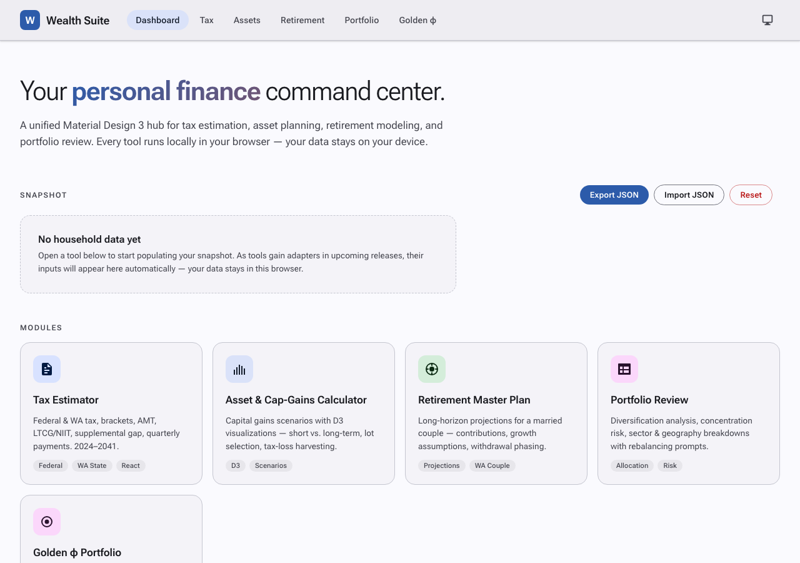

---

## A walkthrough

### 1. Enter your data in the Data Hub

Click **Data Hub** in the sidebar (or the Data Hub promo card near the sidebar's footer). This is where all data entry happens:

- **Import Stock Assets** — drag/drop or paste a CSV from Fidelity, Schwab, Vanguard, or a generic 3-column format. Columns auto-map (ticker, shares, cost basis, account, purchase date); use "Edit mapping" if the auto-detection guesses wrong. Each row is a purchase lot: rows that share a ticker and account name are combined into one position that keeps every lot. The preview shows one line per position (with a lot count) and New/Update status before you commit.
- **Accounts Registry** — add each brokerage/retirement account and tag it Taxable, Tax Free, or Tax Deferred. Imported holdings link to these by account name, and the Portfolio Tracker uses the tagging to total your taxable vs. tax-advantaged balances.
- **Other Assets & Liabilities** — home value, other real estate, mortgages, loans, credit cards.
- **Refresh Prices** — pull live quotes for everything you've imported (shared 15-minute cache with the Portfolio Tracker).
- **Expense Import** — drop a bank CSV to seed the Expense Tracker (or use the link-out to import from inside that tool instead).
- **Export Backup** — downloads a full JSON snapshot of your data. Use it to move between devices or back up before a Reset.

### 2. Fill in your household in the Tax Estimator

Click **Tax Estimator** in the sidebar — it's the suite's most detailed data-entry tool.

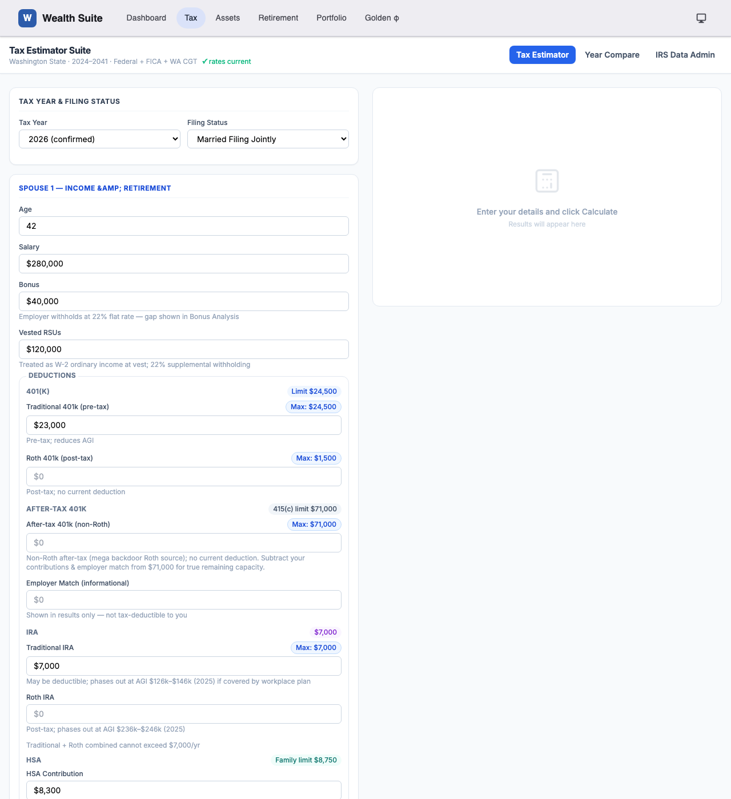

What to fill in:
- **Tax Year** — defaults to 2026, projected from 2025 IRS data (2.5% COLA). 2024 and 2025 are confirmed; 2027+ are editable in the *IRS Data Admin* tab.
- **Filing Status** — Single or Married Filing Jointly. (MFS is not modelled.)
- **Spouse 1 / Spouse 2** — age, salary, bonus, RSU vests, 401(k) contributions (Traditional / Roth / After-tax / Catch-up), IRA, HSA. Use the **Max** chips to fill the legal cap for the year.
- **Capital Gains** — short-term and long-term, household total.
- **Deductions** — standard or itemised (mortgage interest, SALT, charitable).

Every keystroke auto-saves to `localStorage`. The **Calculate Tax** button shows your total liability with bracket breakdown, AMT / NIIT detection, and quarterly-payment suggestions. As you type, the adapter mirrors your household into the suite store — the dashboard updates within a second.

### 3. Set your profile and preferences in Settings

Click **Settings** in the sidebar:

- **Household Profile** — per-spouse birth year and target retire age, plus **annual spending in retirement** and **expected growth %/yr** — these last two are what unlock the dashboard's Retirement Planning card.
- **Scenarios** — create named what-if scenarios (e.g. "Retire at 55") and switch the active one; it overrides the target retire age everywhere (Retirement Planner, Roth Planner, Monte Carlo, dashboard).
- **Tax Profile** — filing status, federal bracket, WA cap-gains excise.
- **Appearance** — theme (light/dark/auto), accent color, currency display format, sidebar default (expanded/collapsed).
- **Alerts** — toggle the quarterly-tax banner, set the stale-data threshold.
- **Data Controls** — Export JSON, Reset (two-click confirm), and "Clear chart caches" if a dashboard chart ever looks wrong.

### 4. Check the dashboard

Click **Dashboard** in the sidebar. Every panel now computes from your real data instead of showing samples:

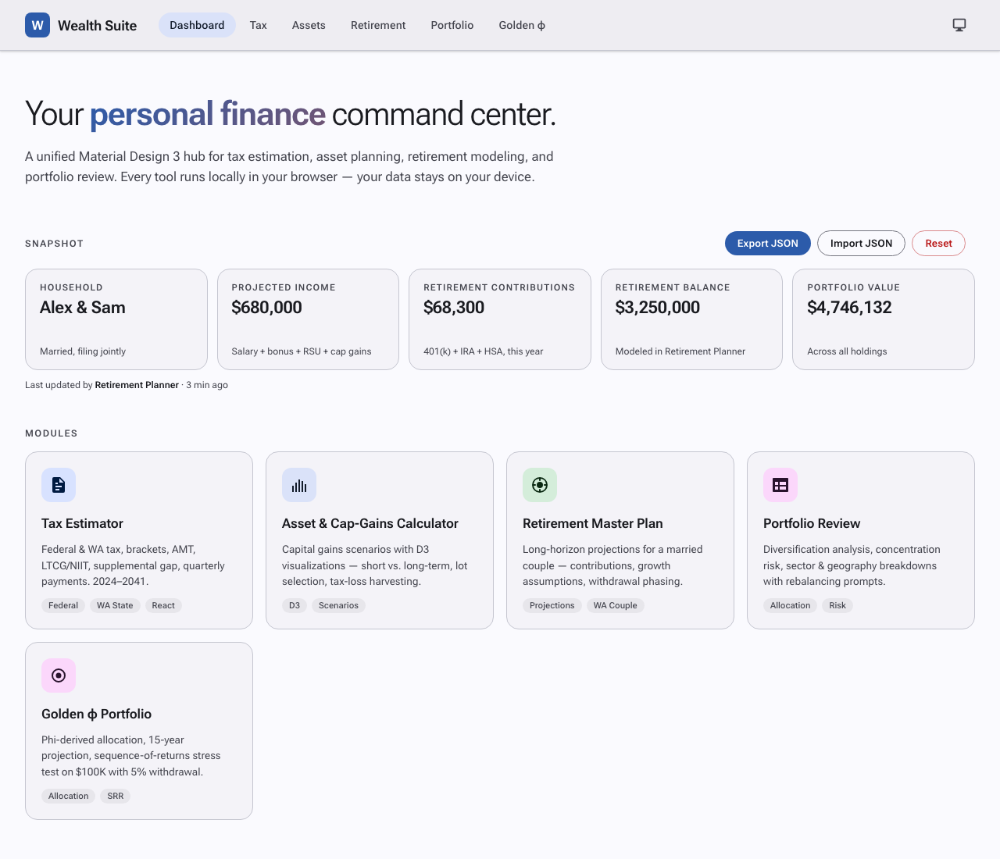

- **KPI tiles** — Total Net Worth, Investment Portfolio, Retirement Readiness, Monthly Spending
- **Net Worth Growth chart** — reconstructed from your holdings' actual price history (not a running log — it recomputes what your portfolio was worth at each past date), with a hover crosshair showing the exact value and date
- **Asset Allocation donut** — your holdings grouped by asset class
- **Retirement Planning card** — a 1,000-path Monte Carlo fan chart (p10/p50/p90) with a hover crosshair for age + percentile values
- **Spending vs Budget** — this month's spend by category vs. your Expense Tracker budgets
- **Performance table** — your holdings' actual since-purchase returns against S&P 500 / VTI / VXUS benchmarks over the same window

A card only shows real numbers once its required inputs exist — until then it stays on the illustrative sample with a note on what's missing.

### 5. Open Retirement Master Plan

Click **Retirement** in the sidebar.

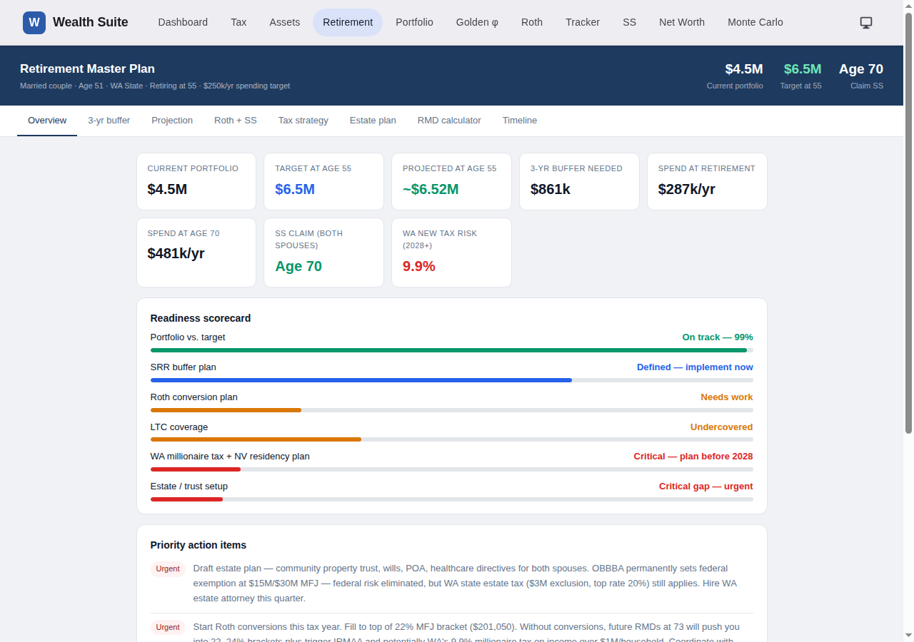

A small all-caps banner under the page title confirms the household context. Browse the tabs:

- **Overview** — readiness scorecard, 8-tile diagnostic
- **3-yr buffer** — sequence-of-returns risk sizing
- **Projection** — bull / base / stress portfolio paths; starting balance seeded from `portfolio.totalValue + retirement.balances.total` plus projected future contributions
- **Roth + SS** — claim-age strategy + cumulative SS benefit
- **Tax strategy / Timeline** — narrative planning reports
- **RMD calculator** — drag the slider to model your traditional-IRA balance at age 73.

Estate planning has its own dedicated page now — see step 6.

### 6. Open Estate Plan

Click **Estate Plan** in the sidebar.

Estate size, WA graduated estate tax over the $3M exclusion, and federal estate tax over the OBBBA thresholds ($30M MFJ / $15M single) all compute live from your net worth once you've entered enough data. A WA-vs-Nevada domicile comparison table and ILIT/trust strategy notes round it out.

### 7. Open Portfolio Review

Click **Portfolio Review** in the sidebar.

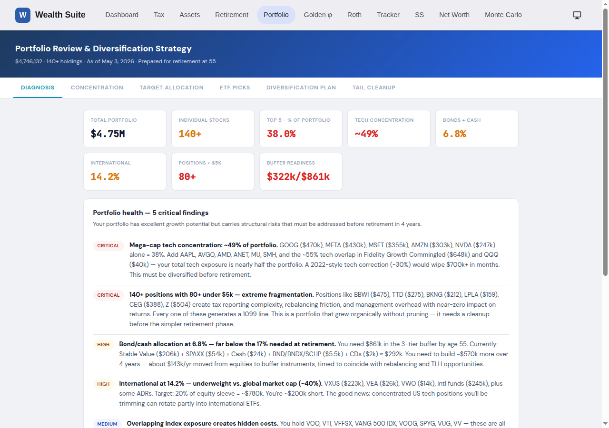

Visiting this page parses the portfolio total from the page header and writes it to `portfolio.totalValue` in the suite store, feeding the dashboard's portfolio tile and the Asset Calculator's Apply button. (If you've already imported holdings via the Data Hub or Portfolio Tracker, this is a secondary, read-only source.)

### 8. Open the Asset & Cap-Gains Calculator

Click **Assets** in the sidebar.

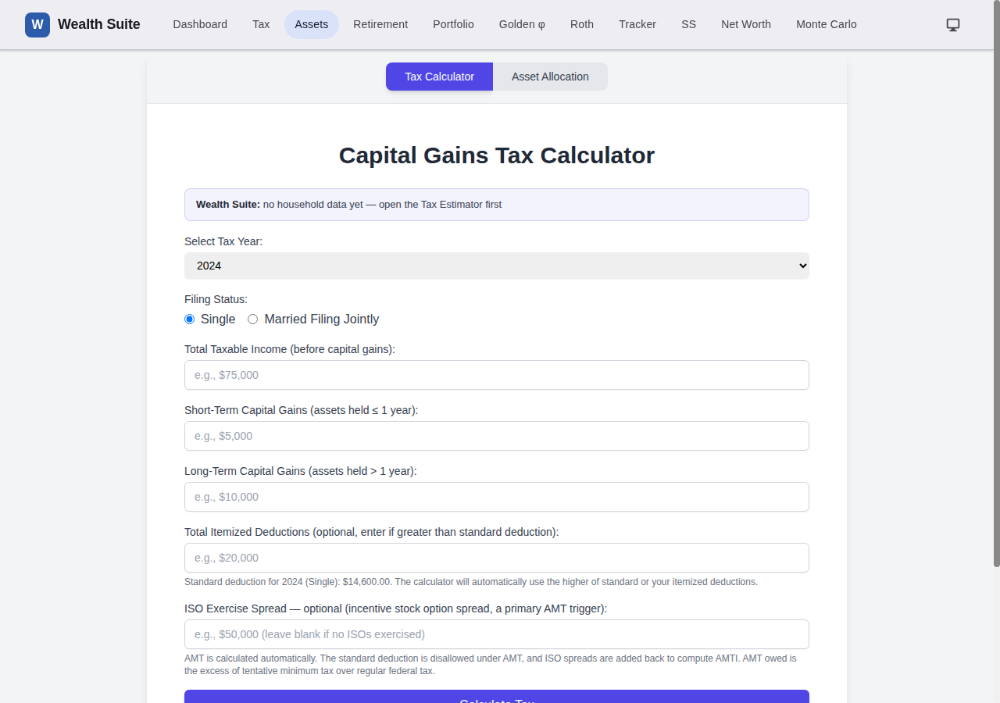

Two tabs — **Tax Calculator** and **Asset Allocation** — each with an "Apply" banner showing the suite's household data. Click **Apply** to pre-fill the form from your household, then tweak any field for what-if scenarios.

### 9. Golden φ Portfolio

Click **Golden φ** in the sidebar.

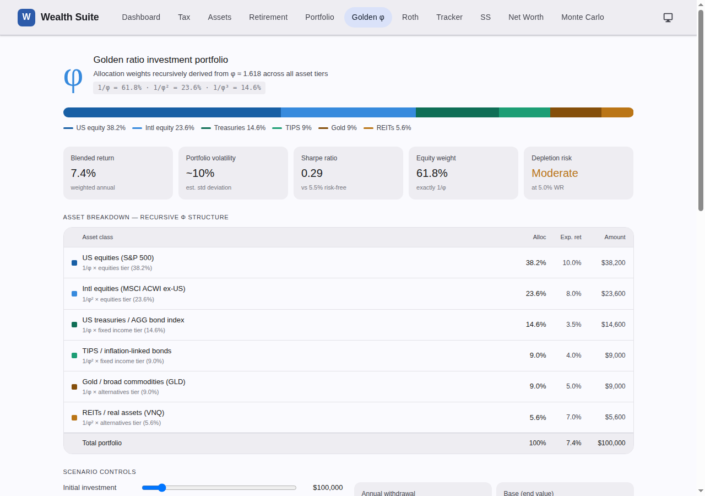

Seeds the investment amount from `portfolio.totalValue` and the withdrawal rate from `annualExpenses / totalValue` automatically. The projection and stress-test charts update to reflect your real numbers.

### 10. Roth Conversion Planner

Click **Roth** in the sidebar.

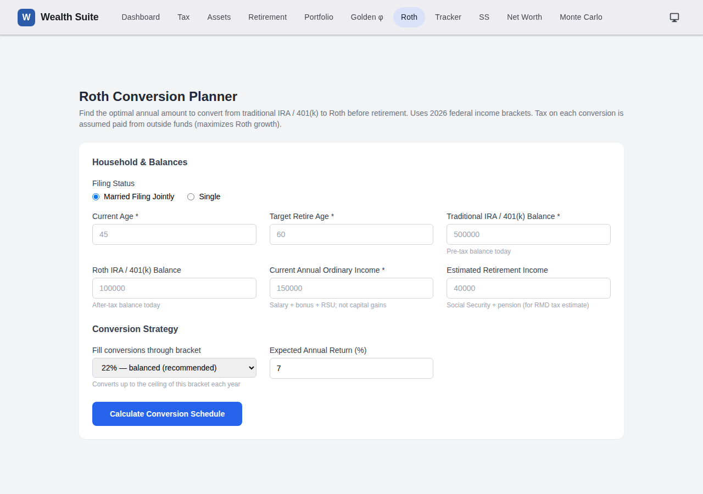

Choose a bracket ceiling (e.g. "22% — balanced"), set your traditional and Roth balances, and click **Calculate Conversion Schedule**. The planner fills to that bracket each year from now until your retire age and shows:
- Year-by-year: age, amount converted, bracket used, tax owed
- Side-by-side: Roth balance after conversions vs. traditional balance with RMDs

### 11. Portfolio Tracker

Click **Tracker** in the sidebar.

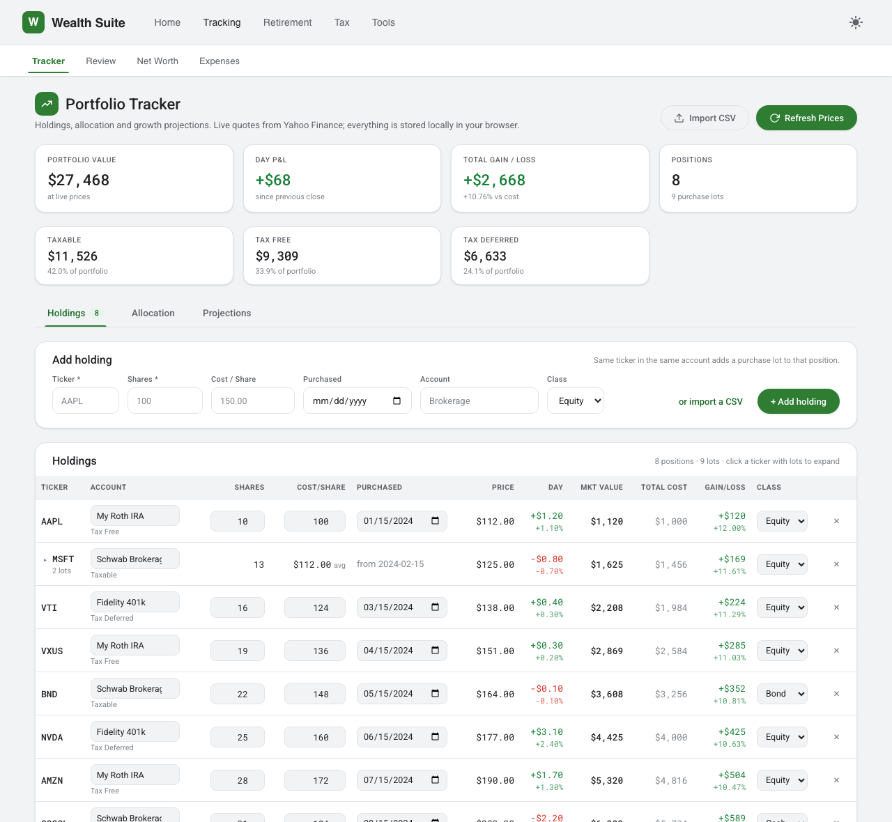

Import a CSV from Fidelity, Schwab, Vanguard, or a generic 3-column format — the same importer logic as the Data Hub, including purchase dates and account names. Positions with several purchase lots show a ▸ toggle on the ticker that expands a per-lot table (date, shares, cost, gain/loss — each editable); the parent row shows the totals and the weighted-average cost. Adding a ticker you already hold in the same account appends a lot instead of a duplicate row. Prices refresh from Yahoo Finance (cached 15 min). Once you've tagged accounts by tax treatment in the Data Hub (or here directly), a second tile row shows your Taxable / Tax Free / Tax Deferred totals.

### 12. Expense Tracker

Click **Expenses** in the sidebar.

Import a bank CSV (Chase, Amex, Citi, or generic) — the importer auto-categorises transactions using keyword rules and any merchants you've manually categorised before. Set monthly budgets per category; the dashboard's Spending vs Budget card and the Retirement Planner's "adopt actual spend" pill both read from this.

### 13. Social Security Estimator

Click **SS** in the sidebar.

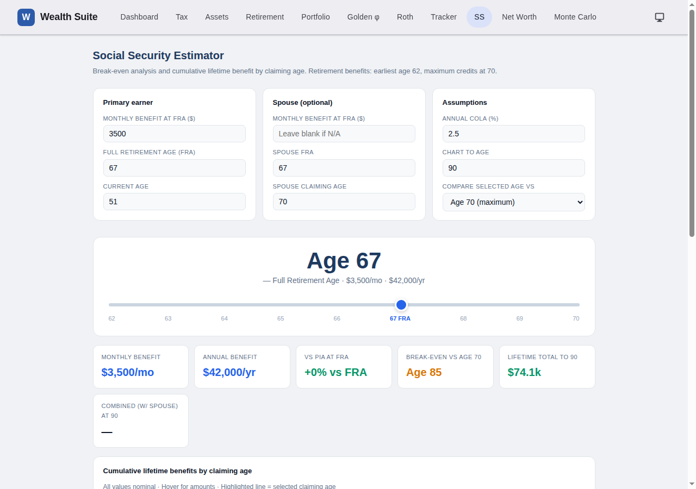

Drag the claiming-age slider from 62 to 70. The KPI tiles update live:
- Monthly / annual benefit at the selected age
- % vs. your PIA at FRA
- Break-even age vs. claiming at 70
- Cumulative lifetime total to your chart-end age
- Combined household total (if spouse fields are filled)

### 14. Net Worth Tracker

Click **Net Worth** in the sidebar.

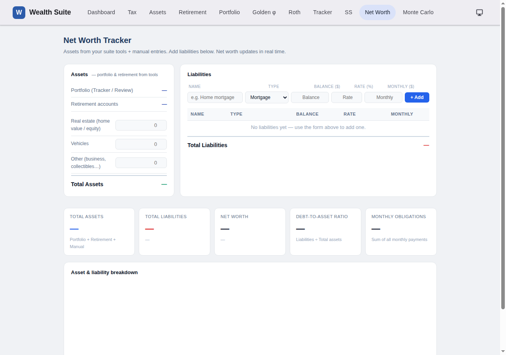

- **Assets (left)** — portfolio value, retirement balances, and other assets are pulled from the Data Hub automatically.
- **Liabilities (right)** — mortgages and loans you added in the Data Hub, or add them here directly.
- The summary card shows Total Assets − Total Liabilities = **Net Worth**.

### 15. Monte Carlo Retirement Projections

Click **Monte Carlo** in the sidebar.

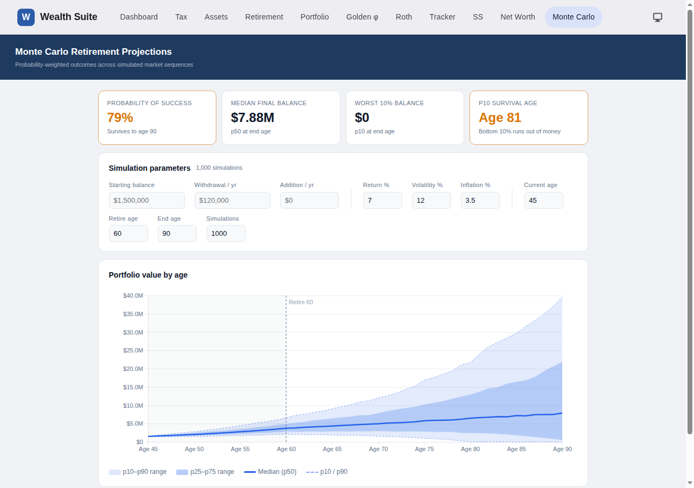

Starting balance, withdrawal, current age, and retire age are seeded from the suite store — this page is read-only with respect to the store (edits here don't write back; use Settings to change your actual plan). The **fan chart** shows five percentile bands from now to your end age with a hover crosshair. **KPI tiles**: probability of success, median final balance, worst-10% balance, and p10 survival age.

---

## Backups & sharing

- **Data Hub → Export Backup** — downloads a full JSON snapshot of everything: household, income, holdings, accounts, liabilities, expenses, preferences. Use it to move between devices or back up before a Reset.
- **Settings → Data Controls** — Export JSON (same backup), a two-click-to-confirm Reset, and "Clear chart caches" (wipes cached price history/legacy snapshots without touching your actual data — use if a dashboard chart looks wrong).
- To restore a backup, use the Data Hub's import — pick a previously exported file.

(Per-section CSV export and the old "Print Snapshot" button from the pre-shell dashboard didn't survive the Release 5 rebuild; full JSON export/import is the current backup path.)

---

## Theme & appearance

**Settings → Appearance** controls theme (light / dark / auto), accent color, currency display format, and whether the sidebar starts collapsed. Your choices are remembered across all tools and sessions, and apply live to every open tool.

---

## Tips & gotchas

- **Tax Estimator is the most thorough data-entry tool.** The Data Hub covers holdings/accounts/assets/liabilities, but income, contributions, and deductions still live in the Tax Estimator.
- **Portfolio Tracker and the Data Hub share one holdings list.** Import or edit in either place; both read/write `portfolio.holdings`.
- **Asset Calculator clamps to 2024–2026 brackets.** If your store has a later tax year selected, the Asset Calc uses 2026 data (its latest). The Tax Estimator itself supports 2024–2041.
- **Data schema is versioned (currently v5).** Backups exported by older versions of the suite migrate automatically on import.
- **Monte Carlo results are not financial advice.** Normal-distribution returns don't capture fat tails, correlation breaks in crises, or sequence-of-returns risk beyond what the volatility parameter models.
- **MFJ-only.** Married Filing Separately is not supported. WA-only for state tax.
- **Privacy.** Nothing leaves your browser unless you click Export. Live price/quote fetches only send public ticker symbols, never account details.

---

## Troubleshooting

- **A card shows a "Sample" badge even though I entered data.** Hover or check the card's subtitle — it names the specific store field still missing (e.g. annual spending, retire age).
- **Portfolio Tracker shows "stale" badge on prices.** Yahoo Finance fetch failed; the last known price is being used. Check your network connection, or use Refresh Prices again after the 15-minute cache expires.
- **A dashboard chart looks wrong / stuck on old data.** Settings → Data Controls → "Clear chart caches", then revisit the Dashboard — it re-downloads price history in the background.
- **Data feels stale after Reset.** Reset clears your entered data and device-local chart caches; theme and IRS rates cache are preserved by design. For a full clean slate, clear the entire site's `localStorage` in your browser's DevTools.
- **Imported file rejected.** It must be a JSON file previously exported from the Data Hub or Settings. Free-form JSON is not accepted.
- **The sidebar's Data Hub/Settings links seem unreachable on my phone.** Scroll down inside the open drawer — the footer scrolls with the nav list on short viewports.
- **A page won't render.** The tools depend on CDN scripts (React, Tailwind, Chart.js, D3). If your network blocks `unpkg.com`, `cdnjs.cloudflare.com`, or `cdn.tailwindcss.com` (corporate firewall, ad-blocker), open DevTools → Network to see which fetch failed.

---

## Running locally

```bash
# from the repo root
python3 -m http.server 3001 --bind 127.0.0.1
# open http://127.0.0.1:3001/
```

Any static file server works. No build step. After editing any file under `assets/`, bump the `?v=N` query string on its `<script>` / `<link>` tag in every HTML page that references it so browsers don't serve a stale cached copy.
