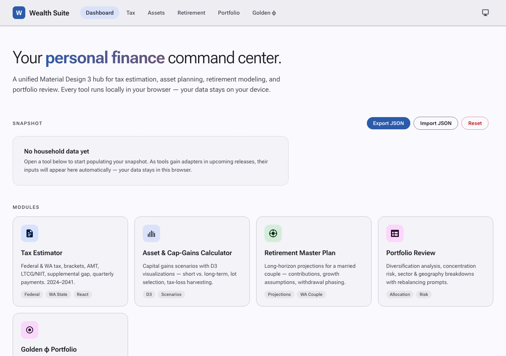
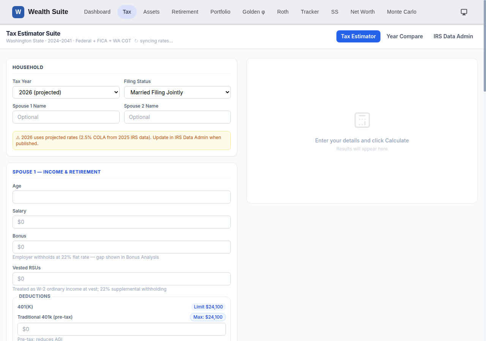
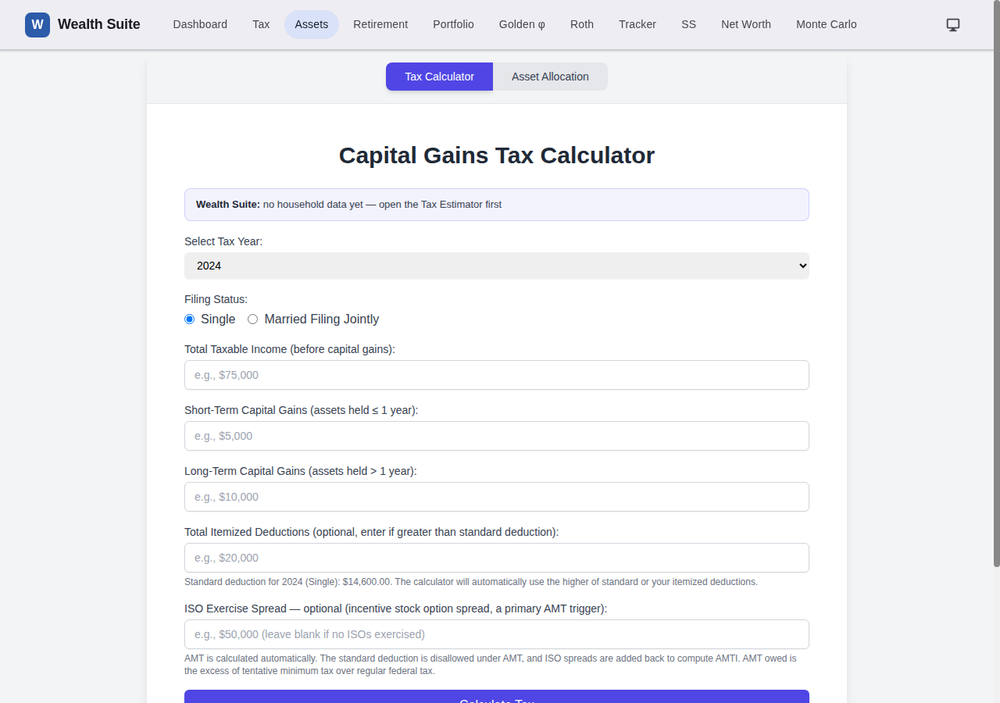
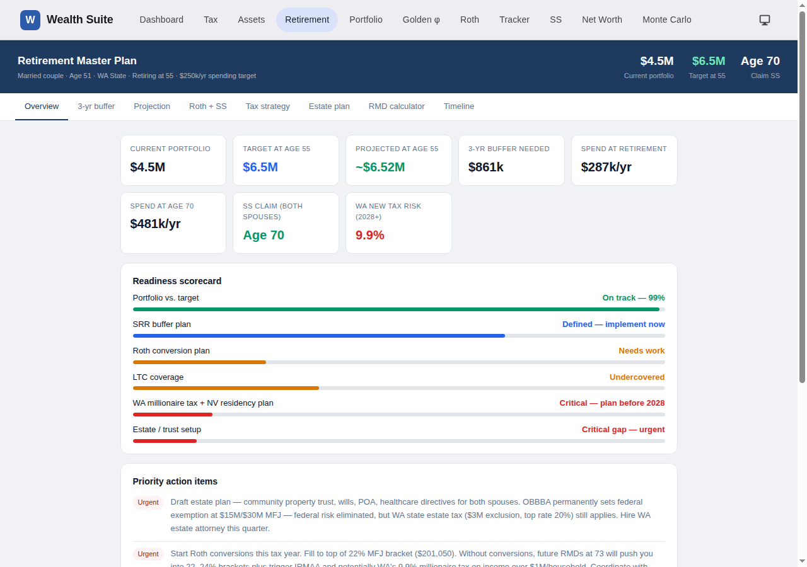
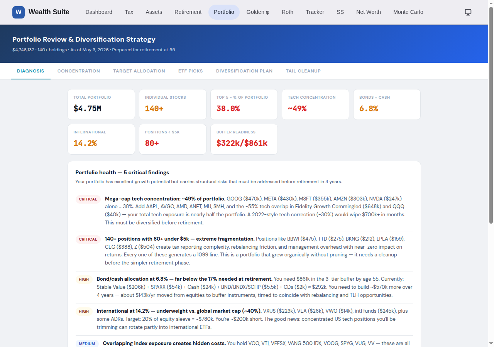
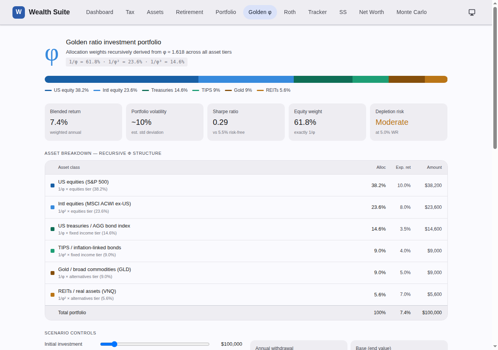

# Release 1 — Core Tools & Dashboard Shell

> **Phase 1** · Initial public release

Five specialised finance tools unified under a Material Design 3 dashboard, deployed as a zero-build static site on GitHub Pages.

---

## New modules

### Dashboard (`index.html`)

The command-centre landing page. A Material Design 3 hero section introduces the suite, followed by a **Snapshot** card (empty at first run) and a **Modules** grid linking to every tool.

Key elements:
- Hero tagline + sub-copy
- Snapshot card with "No household data yet" placeholder
- Module cards with accent colours, descriptions, and direct links
- Suite topbar with Wealth Suite wordmark and full module navigation
- Theme toggle (system → light → dark) persisted to `localStorage`

---

### Tax Estimator (`TaxEstimatorV5.html`)

Federal + Washington State tax estimator for tax years 2024–2041. The primary data-entry point for the household.

Features:
- **Per-spouse income** — salary, bonus, RSU vests (with supplemental withholding gap detection)
- **Retirement contributions** — Traditional 401(k), Roth 401(k), After-tax 401(k), catch-up, IRA, HSA with annual legal-limit Max chips
- **Capital gains** — short-term and long-term, household total
- **Deductions** — standard or itemised (mortgage interest, SALT cap, charitable)
- **Full bracket breakdown** — federal ordinary, LTCG rates, NIIT, Washington Capital Gains Tax, quarterly-payment suggestions
- **AMT detection** — Alternative Minimum Tax calculation
- **Tax-year selector** — 2024 and 2025 IRS data confirmed; 2026+ projected with 2.5% COLA (editable in IRS Data Admin tab)
- **Auto-save** — all inputs persisted to `taxSuiteInputs_v2` in `localStorage` on every keystroke

---

### Asset & Cap-Gains Calculator (`TaxAssetCalcv4.html`)

Capital-gains scenario modelling with D3 visualisations.

Features:
- **Tax Calculator tab** — enter ordinary income, ST/LT gains, filing status; outputs federal ordinary, federal LTCG, NIIT, WA CGT
- **Asset Allocation tab** — enter total portfolio value, set percentage splits across asset classes; outputs dollar amounts per class with D3 donut chart
- **Tax-year support** — 2024–2026 bracket data (IRS Rev. Proc. 2025-32)
- **What-if mode** — tweak any field independently for scenario analysis

---

### Retirement Master Plan (`retirement_master_plan_2.html`)

Long-horizon retirement analysis for a married couple.

Features:
- **Overview tab** — readiness scorecard with 8-tile diagnostic (savings rate, projected balance, income replacement ratio, etc.)
- **3-Year Buffer tab** — sequence-of-returns risk planning; buffer sizing for the first 3 years of retirement
- **Projection tab** — bull / base / stress portfolio paths charted from current age to 90
- **Roth + Social Security tab** — Roth conversion ladder overview; Social Security claim-age strategy with cumulative benefit curves
- **Tax Strategy / Estate Plan / Timeline tabs** — narrative planning reports
- **RMD Calculator** — interactive slider to model traditional-IRA balance at age 73; shows Required Minimum Distribution, taxable income, marginal rate, IRMAA tiers, WA Millionaire Tax impact

---

### Portfolio Review (`portfolio_review.html`)

Structured analysis of a 140-position, ~$4.75 M portfolio.

Features:
- Concentration-risk heat map
- Target allocation table with ETF recommendations
- 4-year diversification plan
- Sector/geography breakdown
- Total portfolio value surfaced in the page header (later parsed by the suite adapter)

---

### Golden φ Portfolio Dashboard (`golden_ratio_portfolio_dashboard.html`)

Phi-derived (1 : 0.618 : 0.382) allocation with stress testing.

Features:
- Portfolio value and withdrawal-rate inputs
- φ-derived allocation wheel and table
- 15-year projection chart at base / bull / bear growth assumptions
- Sequence-of-returns stress test: worst-5-year opening scenario
- Phi-ratio arithmetic explained inline

---

## Suite shell

| Component | Description |
|---|---|
| `assets/suite.css` | Material Design 3 token system — colour roles (`--md-sys-color-*`), shape tokens, surface containers, topbar, snapshot tiles, module cards, action chips |
| `assets/suite.js` | Theme cycler (system / light / dark), sticky topbar injection on all tool pages, module registry |
| GitHub Pages | Auto-deploy via `.github/workflows/pages.yml` on every push to `main`; ~45 s end-to-end |

---

## Architecture decisions

- **Zero build step** — all tools are single-file HTML. React 18 + Tailwind + D3 via CDN where used.
- **Tool isolation** — every tool works standalone if the suite shell doesn't load.
- **Privacy** — no data leaves the browser. No analytics, no account, no server-side persistence.
- **MFJ + Single only** — Married Filing Separately and state taxes beyond WA are not modelled.
