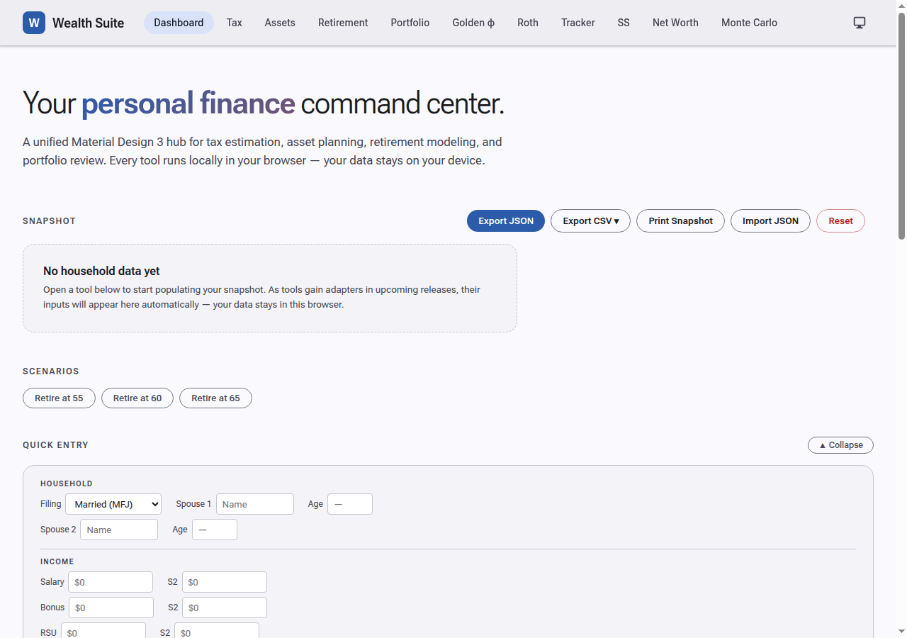

# Release 3 — Dashboard Enhancements & Deep Integration

> **Phase 3** · Named scenarios, CSV export, compact entry, dark mode everywhere, deeper adapters

Release 3 rounds out the original five tools with richer store integration, then adds three major dashboard features: named retirement scenarios, section-level CSV export, and a Quick Entry panel for fast data-entry without leaving the dashboard.

---

## Dashboard — Named Scenarios

A row of scenario chips below the Snapshot card lets you switch between named retirement ages in one click.



- Default chips: **Retire at 55**, **Retire at 60**, **Retire at 65**
- Clicking a chip writes `retirement.plan.targetRetireAge` to the suite store; all adapters listening to that path react immediately (Retirement Planner projection, Golden φ withdrawal-rate, etc.)
- Active chip is highlighted; selection persists in the store so it survives page navigation

---

## Dashboard — Quick Entry (Compact Panel)

A collapsible inline panel on the dashboard replaces the round-trip of opening each tool just to update a single number.

Fields directly on the dashboard:

| Section | Fields |
|---|---|
| **Household** | Filing status, Spouse 1 name + age, Spouse 2 name + age (hidden when Single) |
| **Income** | Salary (S1/S2), Bonus (S1/S2), RSU vests (S1/S2) |
| **Retirement** | Target retire age, Annual expenses, Growth assumption, Retirement balance |
| **Portfolio** | Total portfolio value |

Every field writes directly to the suite store on blur. The panel stays collapsed or expanded across page loads (persisted to `localStorage`). External store changes (e.g. from Tax Estimator in another tab) sync back into the Quick Entry fields in real time, skipping any field currently focused.

---

## Dashboard — CSV Export per Section

The **Export CSV** dropdown lets you download a slice of the household data as a spreadsheet-ready CSV without the full JSON export.

| Download | Contents |
|---|---|
| **Income CSV** | Both spouses — salary, bonus, RSU, capital gains; row per item |
| **Retirement CSV** | 401(k) types, IRA, HSA contributions; target retire age, expenses, growth rate, balance |
| **Portfolio CSV** | Portfolio total value, allocation percentages by asset class |

Files are named `wealth-suite-income-YYYY-MM-DD.csv`, etc.

---

## Deeper adapter integration

### Golden φ adapter (`adapters/golden.js`) — new

Read-only adapter seeding the Golden φ dashboard from the suite store:
- `portfolio.totalValue` → investment amount field (`sI`)
- `retirement.plan.annualExpenses / portfolio.totalValue` → withdrawal rate (`sW`)

The dashboard reruns its projection and stress test automatically with the household's real numbers.

### Retirement adapter v4 (`adapters/retirement.js`)

- **Projection chart seeded from store** — the Projection tab's bull/base/stress chart starting balance is now pre-populated from `portfolio.totalValue + retirement.balances.total`; annual expenses and current ages also seed from the store so the chart reflects the household immediately on page load
- Household banner updated to include portfolio value and years-to-retire

### Portfolio adapter v4 (`adapters/portfolio.js`)

- **Target Allocation table scaling** — the allocation table's target dollar amounts now scale from `portAtRetire` (computed from current portfolio + growth to retire age) rather than static values baked into the HTML
- **Buffer target** — the 3-year buffer target row updates from `retirement.plan.annualExpenses × 3`

---

## Asset Calc — 2026 Tax Year Support

2026 bracket data added using IRS Rev. Proc. 2025-32 confirmed figures:
- Standard deduction, bracket thresholds, LTCG breakpoints, AMT exemption, HSA limits, 401(k) limits all updated for 2026
- Asset Calc now supports 2024, 2025, and 2026; the adapter clamps to the latest available year when the store's `preferences.taxYear` is set to a newer value

---

## Asset Calc — AMT Calculation

Alternative Minimum Tax now fully modelled in the Asset Calculator:
- Form 6251 line-by-line logic: addbacks for standard deduction, SALT excess, ISO spreads
- AMT exemption with phase-out (phaseout threshold varies by year and filing status)
- Displays AMT liability alongside regular tax; shows which is higher and the AMT bump
- NIIT (3.8% net investment income tax) also displayed separately

---

## Dark / Light Mode — All Tool Pages

Theme token system extended from the dashboard to every tool page:
- Each tool page gained a `[data-theme="dark"]` CSS block mirroring the MD3 dark-surface palette
- The theme toggle in the topbar now correctly switches all pages, not just the dashboard
- Tool-local colour references migrated from hardcoded hex to CSS custom properties (`--bg`, `--surface`, `--border`, `--text`, `--muted`, etc.)

---

## Shared Household Banner

Each tool previously reimplemented its own banner logic. In this release the renderer was extracted to `suite.js`:

```js
WealthSuite.renderHouseholdBanner({
  anchor: '.hdr-l p',
  fields: ['portfolio', 'expenses', 'ages', 'yearsToRetire'],
});
```

Adapters call this single function; the banner content and formatting are consistent everywhere and maintained in one place.

---

## Stale-Data Indicators

Snapshot tiles display a subtle warning chip when the relevant section of the store hasn't been updated in more than 30 days, based on `meta.lastUpdated`.

---

## Print / PDF Snapshot (`print.html`)

A clean single-page household summary formatted for printing or saving as PDF:
- All five snapshot sections rendered in a print-optimised layout
- Avoids `color-mix(in oklab, …)` which `html2canvas` cannot parse; uses headless-Chrome-compatible colours
- Accessible from the **Print Snapshot** button on the dashboard action bar
