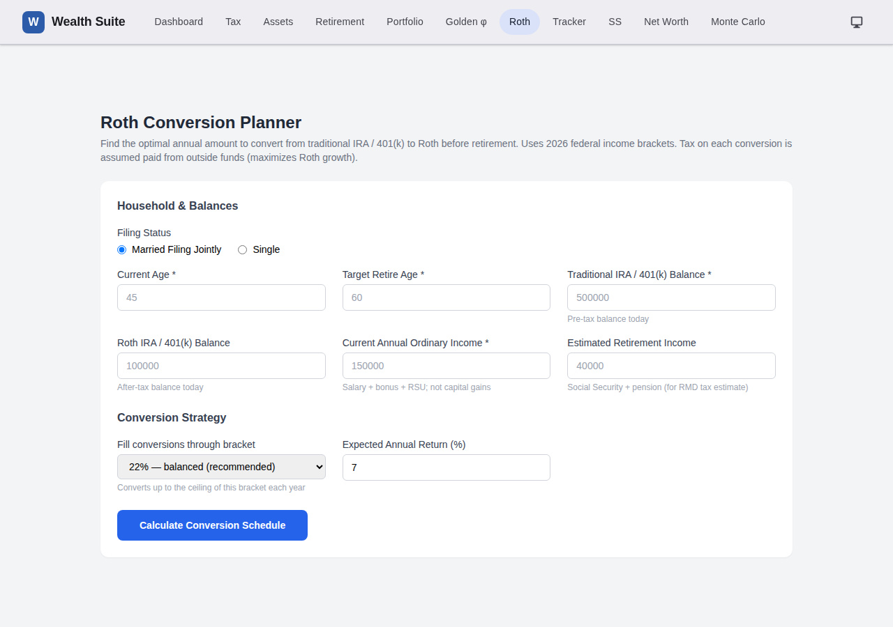
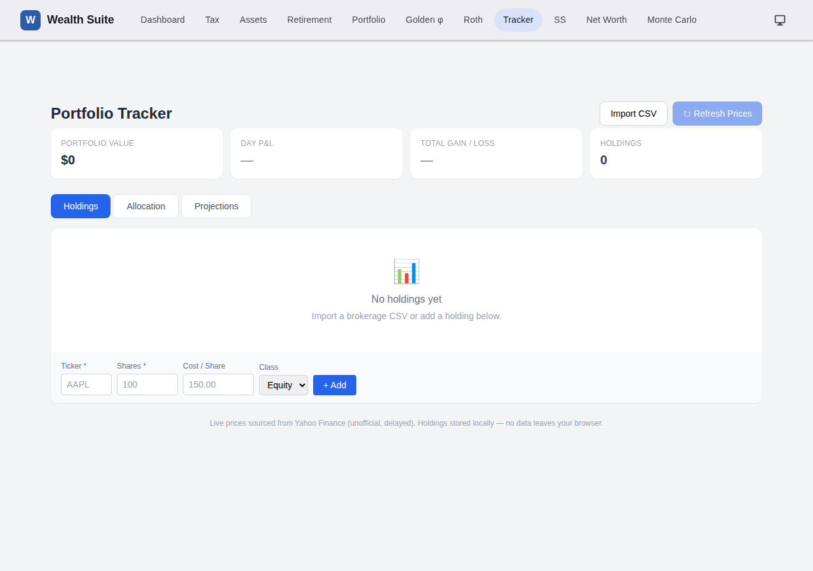
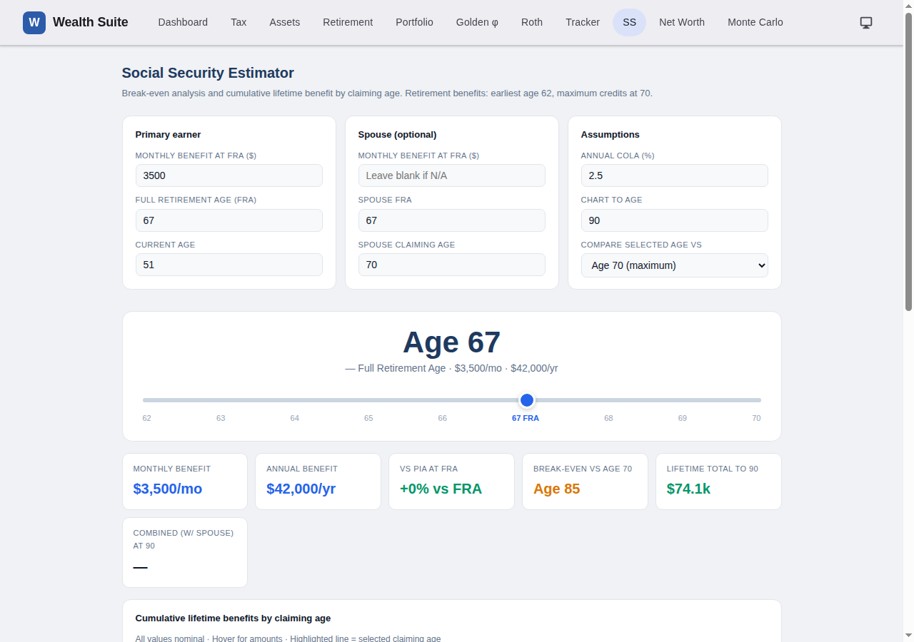
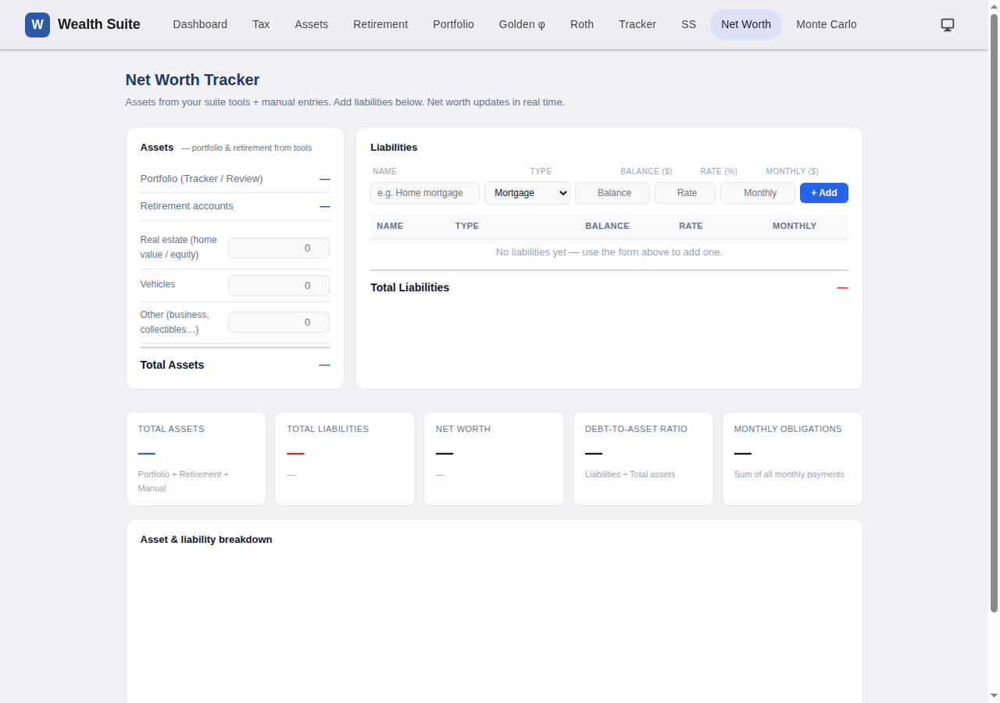
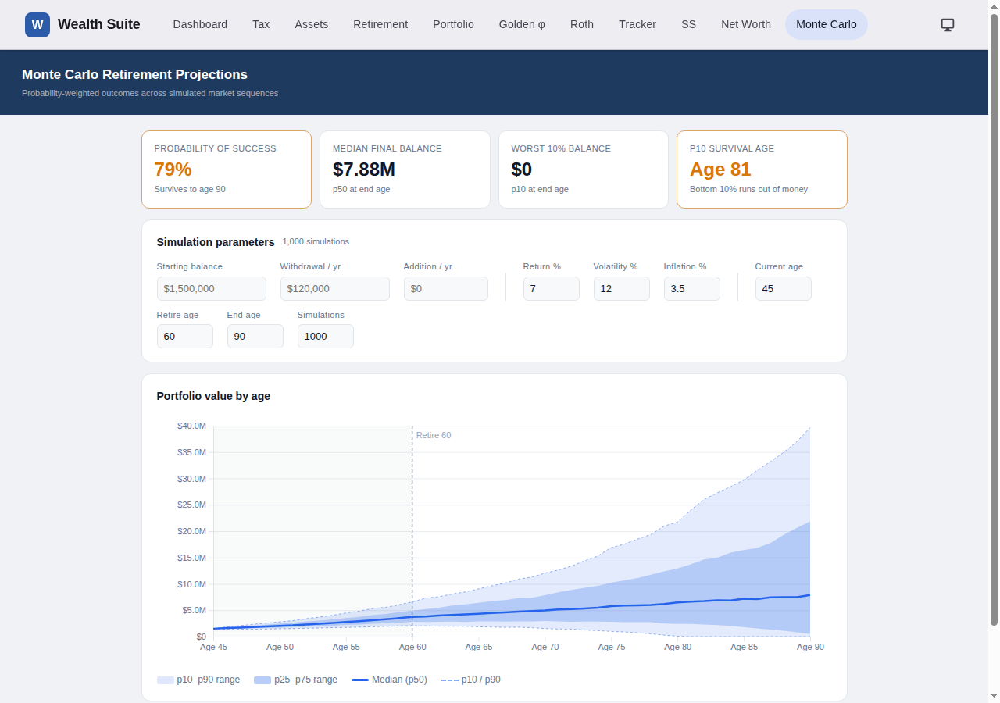

# Release 4 — New Tools

> **Phases 4–7** · Roth Conversion Planner · Portfolio Tracker · Social Security Estimator · Net Worth Tracker · Monte Carlo Retirement Projections

Five new full-featured tools added to the suite. Each follows the adapter pattern — standalone by default, automatically seeded from the household store when suite data is present.

---

## Roth Conversion Planner (`roth_conversion.html`)

Find the optimal annual conversion amount from traditional IRA / 401(k) to Roth before retirement, minimising lifetime tax drag.

### Inputs

| Field | Source |
|---|---|
| Filing status | Seeded from `household.filingStatus` |
| Current age / Target retire age | Seeded from `household.spouses` + `retirement.plan` |
| Traditional IRA / 401(k) balance | Entered manually (placeholder from `retirement.balances.total`) |
| Roth IRA / 401(k) balance | Entered manually |
| Current annual ordinary income | Seeded from `income.salary + bonus + rsuVests` |
| Estimated retirement income | Entered manually (SS + pension estimate) |
| Fill-through bracket | Dropdown: 10%, 12%, 22%, 24%, 32% — choose your ceiling |
| Expected annual return | Default 7% |

### Outputs

- **Year-by-year conversion schedule** — age, conversion amount, marginal bracket used, federal tax owed on conversion
- **Roth vs. no-conversion balance** — side-by-side projection to retire age; shows cumulative Roth balance after conversions vs. traditional balance with future RMDs
- **Tax drag summary** — total tax paid on conversions vs. estimated RMD tax burden avoided

### How conversions are computed

Each year, the planner fills the chosen bracket: it converts enough traditional assets to bring taxable income (ordinary income + conversion) up to the ceiling of the selected bracket. Tax on the conversion is assumed paid from outside funds (maximises Roth compounding). Conversions stop at retire age.

---

## Portfolio Tracker (`portfolio_tracker.html`)

Live portfolio tracker with brokerage CSV import, real-time Yahoo Finance prices, and D3 allocation and projection charts.

### Holdings import

Drag-and-drop or file-picker CSV import for four brokerage formats:

| Brokerage | Key columns parsed |
|---|---|
| Fidelity | `Symbol`, `Quantity`, `Current Value`, `Average Cost Basis` |
| Schwab | `Symbol`, `Quantity`, `Market Value`, `Cost Basis` |
| Vanguard | `Symbol`, `Shares`, `Current Value`, `Cost Basis Total` |
| Generic 3-col | `ticker`, `shares`, `cost_basis` |

Each holding is tagged with an asset class (`equity` / `bond` / `cash` / `other`) inferred from the ticker or editable after import.

### Live price refresh

Prices are fetched from the Yahoo Finance public endpoint (`https://query1.finance.yahoo.com/v8/finance/chart/{ticker}`) client-side — no API key required. Prices are cached in `sessionStorage` for 15 minutes to avoid hammering the endpoint. If a fetch fails, the last known price is shown with a "stale" badge.

### Holdings table

Per-holding columns: ticker, name, shares, cost basis, current price, current value, day $ change, day % change, total gain/loss %. Click any column header to sort.

### Allocation donut (D3)

Current allocation vs. target allocation (read from `portfolio.allocations` in the suite store). Visual gap between current and target highlights rebalancing needs.

### Projection chart (D3)

Line chart showing 1 / 3 / 5 / 10 / 15 year portfolio growth at configurable CAGR per asset class (defaults: equity 7%, bond 3.5%, cash 0.5%).

### Suite store write-back

On every price refresh or holdings change, the tracker writes:
- `portfolio.totalValue` — sum of all holding current values
- `portfolio.allocations` — percentage by asset class
- `portfolio.holdings[]` — full holdings array with prices and timestamps

---

## Social Security Estimator (`social_security.html`)

Claiming-age analysis with break-even curves and cumulative lifetime benefit chart.

### Inputs

| Field | Description |
|---|---|
| Monthly benefit at FRA | Your Primary Insurance Amount (from SS statement) |
| Full Retirement Age (FRA) | Typically 67 for those born 1960+ |
| Current age | Seeded from `household.spouses[0].age` |
| Spouse FRA benefit + claiming age | Optional — for combined household analysis |
| Annual COLA | Default 2.5% |
| Chart-to age | Default 90 |

### Claiming-age slider

Drag the slider from age 62 (earliest, 70% of FRA benefit) to age 70 (maximum, 124% of FRA benefit for those with FRA 67). The large age display updates in real time with the monthly and annual benefit at that claiming age.

### KPI tiles (update live)

- **Monthly benefit** at selected claiming age
- **Annual benefit**
- **% vs. PIA at FRA** — shows reduction (negative) or credit (positive)
- **Break-even vs. Age 70** — the age at which the cumulative benefit from claiming earlier equals what you'd have received by waiting to 70
- **Lifetime total to end age** — cumulative nominal benefit to the chart's end age
- **Combined (w/ Spouse)** — household total if spouse fields are filled

### Cumulative benefit chart (Chart.js)

Multi-line chart showing cumulative lifetime benefit for claiming at 62, 64, 67 (FRA), 70, and the currently-selected age. The selected-age line is highlighted; hover any point for exact values. Crossover points (break-even ages) are visible as line intersections.

---

## Net Worth Tracker (`net_worth.html`)

Full net worth picture: assets from the suite store plus manual entries on the left; liabilities you add on the right.

### Assets panel (left column)

| Row | Source |
|---|---|
| Portfolio value | `portfolio.totalValue` from store (shown in blue, read-only) |
| Retirement balances | `retirement.balances.total` from store (shown in blue, read-only) |
| Home value | Manual input, persisted to store |
| Other real estate | Manual input |
| Other assets | Manual input |
| **Total assets** | Computed sum |

Store-sourced values update automatically when Portfolio Tracker or Retirement Planner updates the store. Manual entries persist to `localStorage`.

### Liabilities panel (right column)

Add any number of liabilities with:
- Name (e.g. "Primary mortgage")
- Type: Mortgage / Auto / Student / Credit Card / Other
- Current balance
- Interest rate %
- Monthly payment

The liabilities table shows all entries with a delete button. Total liabilities is summed live.

### Net Worth summary

A summary card at the bottom shows:
- **Total assets**
- **Total liabilities**
- **Net worth** (assets − liabilities), colour-coded green / red

### Schema v2 migration

This tool introduced `liabilities[]` to the suite store schema, requiring a `meta.version` bump to `2`. The `migrate()` function in `suite-state.js` silently upgrades v1 snapshots on first load.

---

## Monte Carlo Retirement Projections (`monte_carlo.html`)

Probability-weighted retirement outcome analysis across 1,000 simulated market sequences.

### Simulation engine

Each simulation draws independent annual returns from a **normal distribution** parameterised by mean return and volatility (Box-Muller transform). Returns apply before withdrawals.

Two phases per simulation:
- **Accumulation** (current age → retire age): `balance = balance × (1 + r) + annual_contribution`
- **Drawdown** (retire age → end age): `balance = max(0, balance × (1 + r) − withdrawal)` where withdrawal inflates each year at the stated inflation rate

Simulations run synchronously in a `setTimeout(..., 0)` block to keep the UI responsive during the computation.

### Inputs

| Field | Seeded from store | Default |
|---|---|---|
| Starting balance | `portfolio.totalValue + retirement.balances.total` | $1,500,000 |
| Withdrawal / yr | `retirement.plan.annualExpenses` | $120,000 |
| Addition / yr | — | $0 |
| Return % | `retirement.plan.growthAssumption` | 7% |
| Volatility % | — | 12% |
| Inflation % | — | 3.5% |
| Current age | `min(household.spouses[*].age)` | 45 |
| Retire age | `retirement.plan.targetRetireAge` | 60 |
| End age | — | 90 |
| Simulations | — | 1,000 |

### KPI tiles

| Tile | Definition |
|---|---|
| **Probability of success** | % of simulations where balance > 0 at end age |
| **Median final balance** | p50 portfolio value at end age |
| **Worst 10% balance** | p10 portfolio value at end age |
| **p10 Survival age** | Age at which the worst-10% scenario first hits $0; shown as "survives to end age" if p10 > 0 at end age |

Tiles are colour-coded green / amber / red based on success rate and survival age thresholds.

### Fan chart (D3)

A fan chart renders five percentile bands across every age from current to end:

| Element | Meaning |
|---|---|
| Wide light band | p10–p90 range (80% of outcomes) |
| Narrow medium band | p25–p75 range (50% of outcomes) |
| Solid line | p50 median |
| Dashed borders | p10 and p90 |
| Dashed vertical line | Retire age |
| Shaded region left of retire age | Accumulation phase |

### Hover tooltip

Move the cursor over the chart to snap a vertical crosshair to the nearest integer age. A floating tooltip shows the portfolio value for all five percentiles (p90, p75, p50, p25, p10) at that age.

### Suite adapter (`adapters/mc.js`)

Read-only — seeds the form inputs from the suite store on page load. No write-back (simulation results are ephemeral). Renders the household banner under the page header showing portfolio, expenses, ages, and years-to-retire.

### Auto-rerun

The simulation re-runs automatically:
- 180 ms after any input changes (debounced)
- On window resize (to redraw the chart at the new width)
